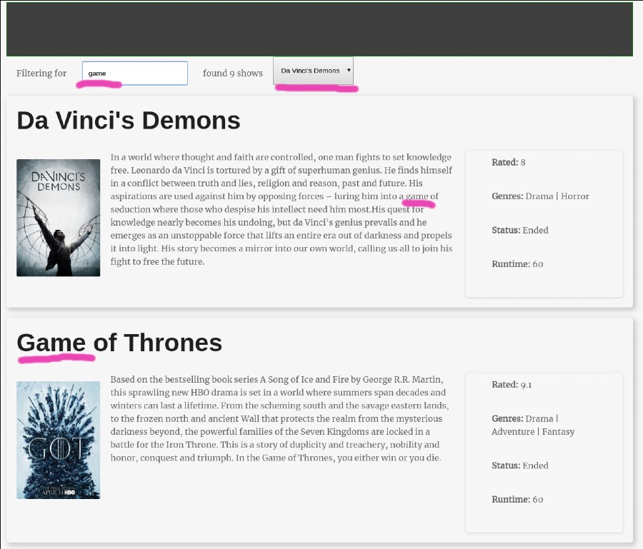

# Level 500

For level 500, you should switch back to your original codebase.

You should have merged someone else's level 400 implementation.

Once again, compare their implementation to yours. Think:

1. How is it different?
2. What do you prefer about your implementation?
3. What do you prefer about their implementation?
4. What did you learn that you didn't know before?

Have a discussion about your answers to these questions. In class, together you should give a 3 minute talk about your conclusions.

## Refactoring

Feel free to change anything in your codebase which you think will make it easier to work with, or to build new features.

Have your partner review any changes you have, and make sure they understand them.

## Adding new functionality

Level 500 is about adding a front-page which lets users select (and find) shows from your shows list.

### Requirements

1. When your app starts, present a listing of all shows ("shows listing")
   1. For each show, you must display at least name, image, summary, genres, status, rating, and runtime..
2. When a show name is clicked, your app should:
   1. Fetch and present episodes from that show (enabling episode search and selection as before)
   2. Hide the "shows listing" view
3. Add a navigation link to enable the user to return to the "shows listing"
   1. When this is clicked, the episodes listing should be hidden
4. Provide a free-text show search through show names, genres, and summary texts
5. Ensure that your episode search and episode selector controls still work correctly when you switch from shows listing to episodes listing and back
6. During one user's visit to your website, you should never fetch any URL more than once.

#### Screenshot of minimal version

Note: Provided your project meets the above requirements, it can **look** however you want.

Here is one example layout.

